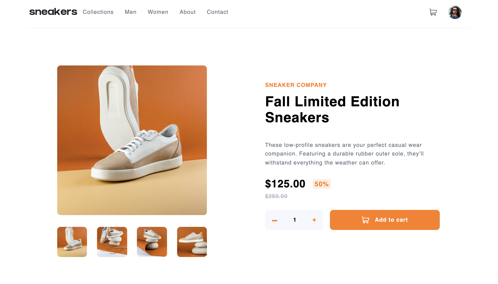
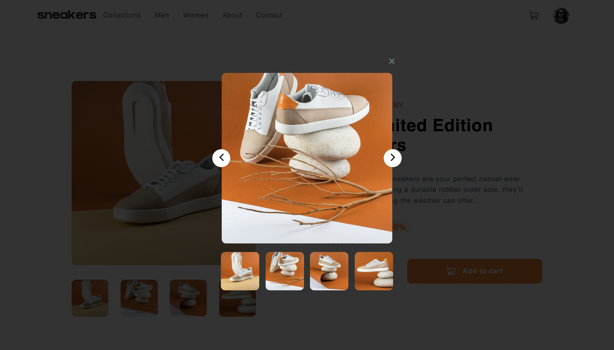
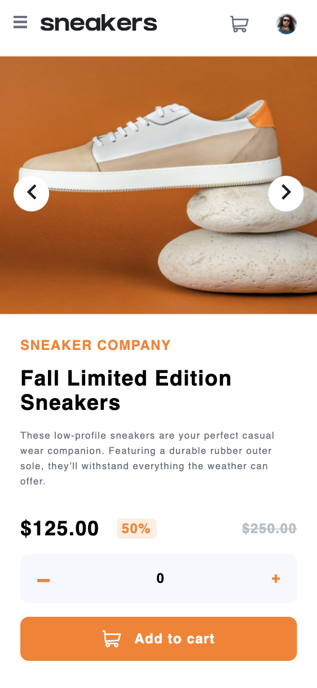

# Frontend Mentor - E-commerce product page solution

This is a solution to the [E-commerce product page challenge on Frontend Mentor](https://www.frontendmentor.io/challenges/ecommerce-product-page-UPsZ9MJp6). Frontend Mentor challenges help you improve your coding skills by building realistic projects.

## Table of contents

- [Overview](#overview)
  - [The challenge](#the-challenge)
  - [Screenshot](#screenshot)
  - [Links](#links)
- [My process](#my-process)
  - [Built with](#built-with)
  - [What I learned](#what-i-learned)
  - [Continued development](#continued-development)
  - [Useful resources](#useful-resources)
- [Author](#author)

## Overview

### The challenge

Users should be able to:

- View the optimal layout for the site depending on their device's screen size
- See hover states for all interactive elements on the page
- Open a lightbox gallery by clicking on the large product image
- Switch the large product image by clicking on the small thumbnail images
- Add items to the cart
- View the cart and remove items from it

### Screenshot

### Links

- Live Site URL: [Live site URL](https://dianachirita.github.io/ecommerce-product-page/)

## My process

### Built with

- Semantic HTML5 markup
- CSS custom properties
- Flexbox
- Javascript

### What I learned

Working on this project I have practiced my CSS and Javascript skills. I have learned how to create a responsive navigation bar, a lightbox, how to work with SVG images, how to create a preview cart component and make everything responsive for different devices.

### Continued development

I would like to improve the CSS, to make it more compact and reusable. I would also add another page with more products, a checkout page, a collections page etc.

### Useful resources

- [Click outside div-Javascript](https://www.techiedelight.com/hide-div-click-outside-javascript/) - This hides a component if clicked outside of it. This helped me hide the cart component and I would like to use it in future projects.

- [Using SVG](https://css-tricks.com/using-svg/) - This helped me work with SVG images.

- [Creating a lightbox](https://www.youtube.com/watch?v=uKVVSwXdLr0) - This taught me how to create a lightbox.

## Author

- Frontend Mentor - [@DianaChirita](https://www.frontendmentor.io/profile/DianaChirita)
- Twitter - [@dianaa_elena](https://twitter.com/dianaa_elena)
